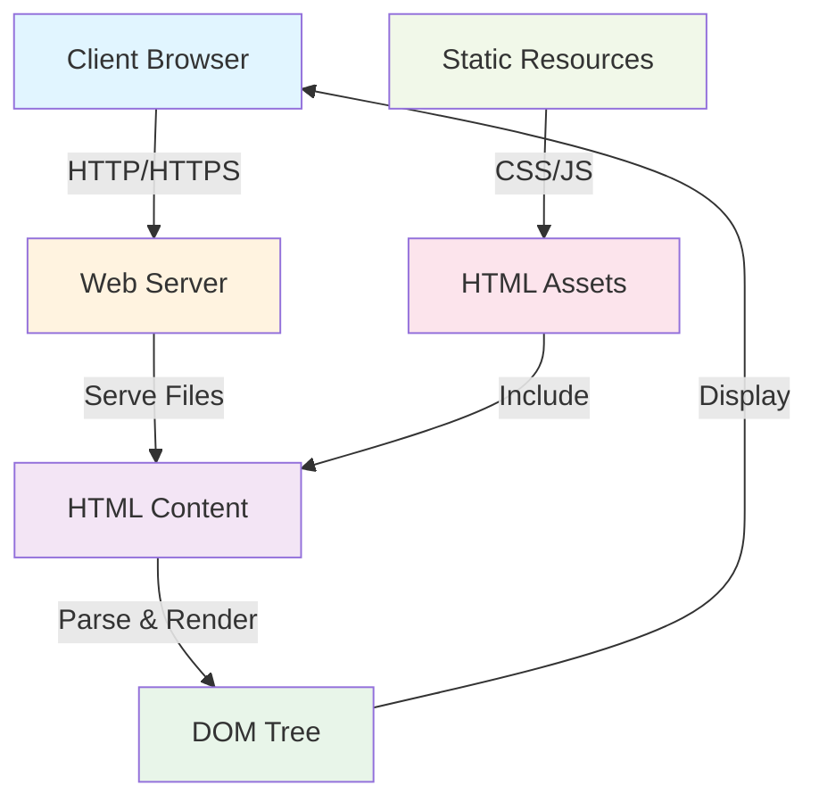

# Architecture Overview

## System Architecture

## Component Overview

| Component | Description | Language |
|-----------|-------------|----------|
| HTML Content | Main markup structure | HTML |
| Client Browser | Rendering engine | Browser |
| Web Server | Content delivery | HTTP Server |
| Static Resources | CSS and JavaScript assets | CSS/JS |

## Data Flow

1. **Client Request**: Browser requests HTML content from web server
2. **Server Response**: Web server serves HTML files and associated resources
3. **Parsing**: Browser parses HTML into DOM tree
4. **Rendering**: Browser renders DOM tree to visual display
5. **Display**: User sees rendered web content

## Technology Stack

- **Frontend**: HTML5
- **Markup**: Semantic HTML
- **Deployment**: Static web hosting
- **Content Delivery**: HTTP/HTTPS

## Key Features

- Pure HTML-based architecture
- Lightweight static content delivery
- Browser-native rendering
- Cross-platform compatibility

---

*Last Updated: 2026-03-19*